# Package Structure Diagram - FE-Admin

## Tổng quan

Dự án được tổ chức theo **Feature-Based Architecture** với các layers rõ ràng. File `.js` và `.css` được tách riêng, CSS được đặt trong folder `styles/` của mỗi feature/component.

---

## Cấu trúc Package chi tiết

```
fe-admin/
│
├── 📁 src/
│   │
│   ├── 📁 config/                    # Application Configuration Layer
│   │   ├── App.js                    # Main App component với routing
│   │   ├── App.test.js               # Unit tests
│   │   └── styles/
│   │       └── App.css               # Global app styles
│   │
│   ├── 📁 features/                  # Feature Modules (Domain/Business Layer)
│   │   │
│   │   ├── 📁 auth/                  # Authentication Feature
│   │   │   ├── Login.js
│   │   │   ├── index.js
│   │   │   └── styles/
│   │   │       └── Login.css
│   │   │
│   │   ├── 📁 dashboard/             # Dashboard Feature
│   │   │   ├── Dashboard.js
│   │   │   ├── index.js
│   │   │   └── styles/
│   │   │       └── Dashboard.css
│   │   │
│   │   ├── 📁 users/                 # User Management Feature
│   │   │   ├── UsersList.js
│   │   │   ├── UserDetail.js
│   │   │   ├── index.js
│   │   │   └── styles/
│   │   │       ├── UsersList.css
│   │   │       └── UserDetail.css
│   │   │
│   │   ├── 📁 pets/                  # Pet Management Feature
│   │   │   ├── PetsList.js
│   │   │   ├── PetDetail.js
│   │   │   ├── Activities.js
│   │   │   ├── index.js
│   │   │   └── styles/
│   │   │       ├── PetsList.css
│   │   │       ├── PetDetail.css
│   │   │       └── Activities.css
│   │   │
│   │   ├── 📁 reports/               # Report Management Feature
│   │   │   ├── ReportsList.js
│   │   │   ├── ReportDetail.js
│   │   │   ├── index.js
│   │   │   └── styles/
│   │   │       ├── ReportsList.css
│   │   │       └── ReportDetail.css
│   │   │
│   │   ├── 📁 experts/               # Expert Management Feature
│   │   │   ├── ExpertList.js
│   │   │   ├── ExpertDetail.js
│   │   │   ├── CreateExpert.js
│   │   │   ├── ExpertChat.js
│   │   │   ├── ExpertNotifications.js
│   │   │   ├── index.js
│   │   │   └── styles/
│   │   │       ├── ExpertList.css
│   │   │       ├── ExpertDetail.css
│   │   │       ├── CreateExpert.css
│   │   │       ├── ExpertChat.css
│   │   │       └── ExpertNotifications.css
│   │   │
│   │   ├── 📁 payments/              # Payment Management Feature
│   │   │   ├── PaymentManagement.js
│   │   │   ├── index.js
│   │   │   └── styles/
│   │   │       └── PaymentManagement.css
│   │   │
│   │   └── 📁 attributes/            # Attribute Management Feature
│   │       ├── AttributeManagement.js
│   │       ├── index.js
│   │       └── styles/
│   │           └── AttributeManagement.css
│   │
│   ├── 📁 shared/                    # Shared Infrastructure Layer
│   │   │
│   │   ├── 📁 api/                   # API Services
│   │   │   ├── apiClient.js          # Axios instance với interceptors
│   │   │   ├── authService.js        # Authentication service
│   │   │   ├── userService.js        # User management service
│   │   │   ├── petService.js         # Pet management service
│   │   │   ├── petPhotoService.js    # Pet photo service
│   │   │   ├── reportService.js      # Report management service
│   │   │   ├── notificationService.js # Notification service
│   │   │   ├── expertService.js      # Expert management service
│   │   │   ├── dashboardService.js   # Dashboard service
│   │   │   ├── chatExpertService.js  # Expert chat service
│   │   │   ├── attributeService.js   # Attribute management service
│   │   │   ├── paymentService.js      # Payment service
│   │   │   └── index.js              # Export tất cả services
│   │   │
│   │   ├── 📁 constants/             # Constants & Configuration
│   │   │   └── index.js              # API endpoints, roles, status, etc.
│   │   │
│   │   ├── 📁 context/               # React Contexts (Global State)
│   │   │   ├── AuthContext.js        # Authentication context
│   │   │   ├── ThemeContext.js       # Theme management context
│   │   │   ├── NotificationContext.js # Notification context
│   │   │   ├── SignalRContext.js     # SignalR real-time context
│   │   │   └── index.js              # Export tất cả contexts
│   │   │
│   │   ├── 📁 hooks/                 # Custom React Hooks
│   │   │   └── index.js              # useApi, useLocalStorage, useDebounce, usePagination
│   │   │
│   │   ├── 📁 utils/                 # Utility Functions
│   │   │   ├── formatDate.js         # Date formatting
│   │   │   ├── formatCurrency.js     # Currency formatting
│   │   │   ├── validateEmail.js      # Email validation
│   │   │   ├── jwtUtils.js           # JWT token utilities
│   │   │   ├── storage.js            # Local storage utilities
│   │   │   ├── debounce.js           # Debounce function
│   │   │   ├── constants.js           # Utility constants
│   │   │   └── index.js              # Export tất cả utilities
│   │   │
│   │   ├── 📁 types/                 # TypeScript Type Definitions
│   │   │   └── index.ts              # Interfaces và types
│   │   │
│   │   └── 📁 data/                  # Mock Data (Development/Testing)
│   │       ├── mockUsers.js
│   │       ├── mockPets.js
│   │       ├── mockReports.js
│   │       ├── mockPayments.js
│   │       └── mockUserNotifications.js
│   │
│   ├── 📁 components/                # UI Components Layer
│   │   │
│   │   ├── 📁 common/                # Common Components
│   │   │   ├── Header.js             # Header component
│   │   │   ├── Sidebar.js            # Admin sidebar
│   │   │   ├── ExpertSidebar.js      # Expert sidebar
│   │   │   ├── ProtectedRoute.js    # Route protection
│   │   │   └── styles/
│   │   │       ├── Header.css
│   │   │       └── Sidebar.css
│   │   │
│   │   ├── 📁 layout/                # Layout Components
│   │   │   ├── AdminLayout.js        # Layout cho Admin
│   │   │   ├── ExpertLayout.js       # Layout cho Expert
│   │   │   └── styles/
│   │   │       └── AdminLayout.css
│   │   │
│   │   ├── 📁 forms/                 # Form Components (trống - có thể thêm sau)
│   │   ├── 📁 ui/                    # Basic UI Components (trống - có thể thêm sau)
│   │   └── index.js                  # Export tất cả components
│   │
│   ├── 📁 assets/                    # Static Assets
│   │   ├── icons/                    # Icon files
│   │   └── images/                   # Image files
│   │
│   ├── index.js                      # Entry point - ReactDOM render
│   ├── index.css                     # Global CSS
│   └── reportWebVitals.js            # Web vitals reporting
│
└── 📁 public/                        # Public Assets
```

---

## Package Diagram - Dependency Flow

### Mermaid Diagram

```mermaid
graph TB
    subgraph "Application Layer"
        Config[config/App.js<br/>Routing & Providers]
    end
    
    subgraph "Feature Layer"
        Auth[features/auth]
        Dashboard[features/dashboard]
        Users[features/users]
        Pets[features/pets]
        Reports[features/reports]
        Experts[features/experts]
        Payments[features/payments]
        Attributes[features/attributes]
    end
    
    subgraph "Component Layer"
        Common[components/common]
        Layout[components/layout]
    end
    
    subgraph "Shared Infrastructure Layer"
        API[shared/api<br/>API Services]
        Context[shared/context<br/>React Contexts]
        Utils[shared/utils<br/>Utilities]
        Constants[shared/constants<br/>Constants]
        Hooks[shared/hooks<br/>Custom Hooks]
        Types[shared/types<br/>TypeScript Types]
        Data[shared/data<br/>Mock Data]
    end
    
    Config --> Auth
    Config --> Dashboard
    Config --> Users
    Config --> Pets
    Config --> Reports
    Config --> Experts
    Config --> Payments
    Config --> Attributes
    Config --> Common
    Config --> Layout
    Config --> Context
    
    Auth --> API
    Auth --> Context
    Auth --> Utils
    Auth --> Common
    
    Dashboard --> API
    Dashboard --> Context
    Dashboard --> Utils
    Dashboard --> Common
    Dashboard --> Layout
    
    Users --> API
    Users --> Context
    Users --> Utils
    Users --> Common
    Users --> Layout
    
    Pets --> API
    Pets --> Context
    Pets --> Utils
    Pets --> Common
    Pets --> Layout
    
    Reports --> API
    Reports --> Context
    Reports --> Utils
    Reports --> Common
    Reports --> Layout
    
    Experts --> API
    Experts --> Context
    Experts --> Utils
    Experts --> Common
    Experts --> Layout
    
    Payments --> API
    Payments --> Context
    Payments --> Utils
    Payments --> Common
    Payments --> Layout
    
    Attributes --> API
    Attributes --> Context
    Attributes --> Utils
    Attributes --> Common
    Attributes --> Layout
    
    Common --> Context
    Common --> Utils
    
    Layout --> Common
    Layout --> Context
    
    API --> Constants
    API --> Utils
```



### ASCII Art Diagram

```
┌─────────────────────────────────────────────────────────────────┐
│                    Application Layer                             │
│                    config/App.js                                 │
│              (Routing & Global Providers)                        │
└───────────────────────┬─────────────────────────────────────────┘
                        │
        ┌───────────────┼───────────────┐
        │               │               │
        ▼               ▼               ▼
┌──────────────┐  ┌──────────────┐  ┌──────────────┐
│  Features    │  │ Components   │  │   Shared     │
│   Layer      │  │    Layer     │  │   Context    │
└──────┬───────┘  └──────┬───────┘  └──────┬───────┘
       │                  │                  │
       │                  │                  │
       └──────────────────┼──────────────────┘
                          │
              ┌───────────┴───────────┐
              │                       │
              ▼                       ▼
      ┌──────────────┐        ┌──────────────┐
      │  shared/api  │        │ shared/utils │
      │  Services    │        │  Utilities   │
      └──────────────┘        └──────────────┘
              │                       │
              └───────────┬───────────┘
                          │
                          ▼
                  ┌──────────────┐
                  │shared/       │
                  │constants     │
                  └──────────────┘
```

---

## Dependency Matrix

### Dependency Rules (Quy tắc phụ thuộc)

| From Layer | To Layer | Allowed | Description |
|------------|----------|---------|-------------|
| config | features | ✅ | Config import features để routing |
| config | components | ✅ | Config import components để layout |
| config | shared/context | ✅ | Config import contexts để providers |
| features | shared/* | ✅ | Features import shared code |
| features | components | ✅ | Features import UI components |
| features | features | ❌ | **Không được** - Features độc lập |
| components | shared/* | ✅ | Components import shared code |
| components | features | ❌ | **Không được** - Components không phụ thuộc features |
| shared | features | ❌ | **Không được** - Shared độc lập |
| shared | components | ❌ | **Không được** - Shared độc lập |
| shared | shared | ✅ | Shared có thể import lẫn nhau |

---

## Layer Responsibilities (Trách nhiệm từng Layer)

### 1. Application Layer (config/)
- **Trách nhiệm**: 
  - Khởi tạo ứng dụng
  - Định nghĩa routing
  - Setup global providers (Auth, Theme, Notification)
- **Dependencies**: 
  - features/* (để routing)
  - components/* (để layout)
  - shared/context/* (để providers)
- **Không phụ thuộc**: shared/api, shared/utils (trừ khi cần)

### 2. Feature Layer (features/)
- **Trách nhiệm**: 
  - Business logic của từng feature
  - Feature-specific pages/components
  - Xử lý user interactions
- **Dependencies**: 
  - shared/api/* (gọi API)
  - shared/context/* (global state)
  - shared/utils/* (utilities)
  - shared/constants/* (constants)
  - components/* (UI components)
- **Không phụ thuộc**: features/* (không có cross-feature dependencies)

### 3. Component Layer (components/)
- **Trách nhiệm**: 
  - Reusable UI components
  - Layout components
  - Common components (Header, Sidebar, etc.)
- **Dependencies**: 
  - shared/context/* (để access global state)
  - shared/utils/* (để utilities)
- **Không phụ thuộc**: features/*, shared/api/*

### 4. Shared Infrastructure Layer (shared/)
- **Trách nhiệm**: 
  - Reusable code across features
  - API services
  - Global state management
  - Utilities và helpers
- **Dependencies**: 
  - Chỉ external libraries (axios, react, etc.)
  - shared/* có thể import lẫn nhau
- **Không phụ thuộc**: features/*, components/*

---

## Package Diagram - Chi tiết theo Module

### Module: Authentication

```
┌─────────────────────┐
│ features/auth/      │
│  ┌───────────────┐  │
│  │ Login.js      │  │
│  │ styles/       │  │
│  └───────┬───────┘  │
└──────────┼───────────┘
           │
    ┌──────┴──────┐
    │             │
    ▼             ▼
┌─────────┐  ┌─────────┐
│shared/  │  │shared/  │
│api      │  │context │
│authSvc  │  │AuthCtx │
└─────────┘  └─────────┘
```

### Module: User Management

```
┌─────────────────────┐
│ features/users/     │
│  ┌───────────────┐  │
│  │ UsersList.js  │  │
│  │ UserDetail.js │  │
│  └───────┬───────┘  │
└──────────┼───────────┘
           │
    ┌──────┼──────┐
    │      │      │
    ▼      ▼      ▼
┌──────┐ ┌──────┐ ┌──────┐
│shared│ │shared│ │shared│
│/api  │ │/api  │ │/api  │
│user  │ │pet   │ │utils │
└──────┘ └──────┘ └──────┘
```

### Module: Expert Management

```
┌─────────────────────┐
│ features/experts/   │
│  ┌───────────────┐  │
│  │ ExpertList.js │  │
│  │ ExpertChat.js │  │
│  │ ...           │  │
│  └───────┬───────┘  │
└──────────┼───────────┘
           │
    ┌──────┼──────┐
    │      │      │
    ▼      ▼      ▼
┌──────┐ ┌──────┐ ┌──────┐
│shared│ │shared│ │shared│
│/api  │ │/api  │ │/api  │
│expert│ │chat  │ │user  │
└──────┘ └──────┘ └──────┘
```

---

## Import Flow Examples (Ví dụ luồng import)

### Example 1: User Feature sử dụng API

```javascript
// features/users/UsersList.js
import { userService, petService } from '../../shared/api';  // ✅ Allowed
import { useAuth } from '../../shared/context';              // ✅ Allowed
import { formatDate } from '../../shared/utils';             // ✅ Allowed
import AdminLayout from '../../components/layout/AdminLayout'; // ✅ Allowed
// import { Dashboard } from '../dashboard';                 // ❌ Forbidden
```

### Example 2: Component sử dụng Context

```javascript
// components/common/Header.js
import { useAuth } from '../../shared/context/AuthContext';  // ✅ Allowed
import { useTheme } from '../../shared/context/ThemeContext'; // ✅ Allowed
// import { Login } from '../../features/auth';              // ❌ Forbidden
```

### Example 3: Shared API sử dụng Utils

```javascript
// shared/api/userService.js
import apiClient from './apiClient';                        // ✅ Allowed
import { API_ENDPOINTS } from '../constants';               // ✅ Allowed
// import { UsersList } from '../../features/users';         // ❌ Forbidden
```

---

## Package Diagram - UML Style

```
┌─────────────────────────────────────────────────────────────┐
│                    <<Application>>                           │
│                    config/App.js                             │
│                    - Routing                                 │
│                    - Global Providers                        │
└───────────────┬─────────────────────────────────────────────┘
                │
    ┌───────────┼───────────┬───────────┐
    │           │           │           │
    ▼           ▼           ▼           ▼
┌─────────┐ ┌─────────┐ ┌─────────┐ ┌─────────┐
│<<Feature│ │<<Feature│ │<<Feature│ │<<Feature│
│auth>>   │ │users>>  │ │pets>>   │ │...>>    │
└────┬────┘ └────┬────┘ └────┬────┘ └────┬────┘
     │           │           │           │
     └───────────┼───────────┼───────────┘
                 │           │
         ┌───────┴───────────┴───────┐
         │                           │
         ▼                           ▼
    ┌─────────┐                 ┌─────────┐
    │<<Shared │                 │<<Shared │
    │API>>    │                 │Context>>│
    └────┬────┘                 └────┬────┘
         │                           │
         └───────────┬───────────────┘
                     │
                     ▼
            ┌─────────────────┐
            │ <<Shared>>       │
            │ Constants        │
            │ Utils            │
            │ Hooks            │
            │ Types            │
            └─────────────────┘
```

---

## Benefits for Package Diagram (Lợi ích cho Package Diagram)

1. **Clear Separation of Concerns**: 
   - Mỗi layer có trách nhiệm rõ ràng
   - Dễ hiểu và maintain

2. **Unidirectional Dependencies**: 
   - Dependencies chỉ đi một chiều (top-down)
   - Không có circular dependencies

3. **Feature Isolation**: 
   - Features không phụ thuộc lẫn nhau
   - Dễ phát triển song song

4. **Shared Reusability**: 
   - Shared code có thể dùng ở mọi nơi
   - Tránh code duplication

5. **Easy Visualization**: 
   - Cấu trúc rõ ràng, dễ vẽ diagram
   - Dễ document và explain

6. **Testability**: 
   - Dễ mock dependencies
   - Dễ test từng layer riêng biệt

---

## Package Diagram Tools

### Có thể sử dụng các tools sau để vẽ package diagram:

1. **PlantUML**:
   ```plantuml
   @startuml
   package "config" {
     [App.js]
   }
   
   package "features" {
     package "auth" {
       [Login.js]
     }
     package "users" {
       [UsersList.js]
       [UserDetail.js]
     }
   }
   
   package "shared" {
     package "api" {
       [userService.js]
       [petService.js]
     }
     package "context" {
       [AuthContext.js]
     }
   }
   
   [App.js] --> [Login.js]
   [App.js] --> [UsersList.js]
   [UsersList.js] --> [userService.js]
   [UsersList.js] --> [AuthContext.js]
   @enduml
   ```

2. **Mermaid** (đã có trong file)

3. **Draw.io / Lucidchart**: Import structure và vẽ manually

4. **Visual Studio Code Extensions**:
   - PlantUML
   - Mermaid Preview
   - Code Map

---

## Notes (Ghi chú)

- Tất cả file `.js` và `.css` được tách riêng
- CSS được đặt trong folder `styles/` của mỗi feature/component
- Mỗi feature có `index.js` để export components
- Shared code được tổ chức theo chức năng (api, context, utils, etc.)
- Không có cross-feature dependencies để đảm bảo tính độc lập
